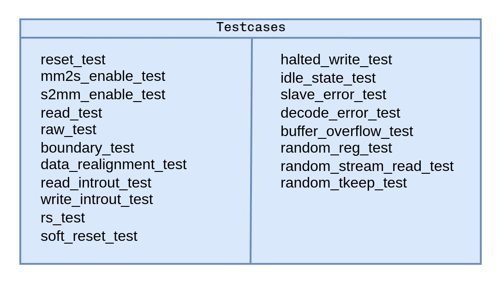

# AXI DMA Verification Project

## Overview
This project focuses on the verification of the **AXI DMA IP** designed in Vivado, with emphasis on the **Direct Register Mode** functionality. The **Scatter/Gather Engine** is intentionally disabled to streamline the verification scope and center efforts on validating the core functionality of the DMA in this configuration.

The primary objective is to ensure that the **AXI DMA** operates correctly and adheres to the defined specifications. Comprehensive testing is conducted to identify and resolve potential design issues, achieving:
- **Functional Correctness**
- **Protocol Compliance**
- **Verification Closure** through coverage metrics

### High-Level Goals
1. **Functionality Verification:** Ensure the DMA performs data movement between memory and AXI-Stream interfaces as expected.  
2. **Protocol Compliance:** Validate adherence to the AMBA AXI and AXI-Stream specifications.  

---

## Features to Verify
Key features verified in this project include:
1. **Read/Write Operations for AXI-Lite Interface**  
   - Validate control and status register read/write operations.  

2. **Data Transfer Using AXI-Stream Interface**  
   - Ensure seamless data movement between AXI-Stream interfaces and system memory.  

3. **Handling Packet Boundaries**  
   - Validate proper recognition, processing, and termination of packets during data transfer.  

4. **Interrupt Generation and Handling**  
   - Test DMA's ability to generate and handle interrupts for events like transfer completion and errors.  

5. **Error Scenarios**  
   - Evaluate DMA behavior under conditions such as buffer overflows.  

---

## Testbench Architecture

### Overview
The **testbench architecture** is designed to validate the functionality and performance of the AXI DMA IP comprehensively. The top-level module, `axi_dma_tb_top`, orchestrates all testbench components and interfaces.

### Components
1. **Interfaces**  
   - **axi_lite_intf (AXI4-Lite):** Configures control and status registers.  
   - **axi_intf (AXI4):** Handles memory-mapped data transactions.  
   - **axis_intf (AXI-Stream):** Facilitates data transfers between the DUT and external systems.  

2. **Block RAM (BRAM)**  
   - Acts as system memory for memory-mapped read/write operations.  

3. **Test Class**  
   - Encapsulates the environment and supports multiple test scenarios.  

### High-Level Overview
The test workflow begins by invoking `run_test("test")` in the top-level module `tb_top`. This triggers:
1. **DUT Configuration:** Control and status registers are configured.  
2. **Sequence Execution:** Sequences drive transactions on the AXI-Stream interfaces.  
3. **Monitoring and Scoreboarding:** Transactions are observed and validated.  
4. **Termination:** Objections are dropped, signaling the test's end.  

#### Testbench Architecture Diagram


### Detailed Workflow
1. **Initialization:**  
   - Environment and UVM components are initialized.  
   - Interfaces are configured using `uvm_config_db`.  
   - During the build_phase of the test, 
   - A dynamic configuration object (env_cfg) is modified to test specific scenarios. For instance: To enable MM2S_Read operation, the SRC_ADDR and the number of bytes to read must be specified. The scoreboard's write operation is disabled to avoid entering an infinite loop.
   - The testbench configuration is derived from this env_cfg file, ensuring all components are tailored for the scenario being verified.

2. **Run Phase:**  
   - DUT configuration, sequence execution, monitoring, and scoreboarding are performed.  

3. **Termination:**  
   - Simulation objections are dropped, and results are reported.  
---
## Test Plan
The test plan includes a comprehensive set of scenarios to validate the DMA's functionality and compliance with specifications. Key tests include:
- **Read/Write Operations:** Validate AXI-Lite read/write behavior.    
- **Interrupt Handling:** Ensure proper response to DMA-generated interrupts.  
---

#### Testcase Legend
## Below is a list of possible testcases that can be executed to validate the AXI DMA IP:


## How to Run the Tests
1. **Compile:**  
   ```bash
   make compile

2. **Elaboration:**  
   ```bash
   make elaborate
   
3. **Simulation:**  
   ```bash
   make simulate TEST_Name=<test_name> (optional)

4. **Regression:**  
   ```bash
   make regress
